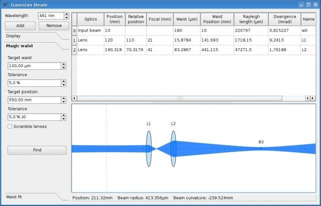

# GaussianBeam

GaussianBeam computes the profile propagation of a Gaussian laser beam through a set of lenses.



## Install from sources

```bash
git clone https://github.com/mer0m/GaussianBeam.git
cd GaussianBeam
```

### Requirements

This software requires the following libraries:
- Qt >= 4.4 (tested with 5.15.8)

### Debian and similar

```bash
qmake
make
# run it in standalone
./gaussianbeam
# or install it
sudo make install
```
